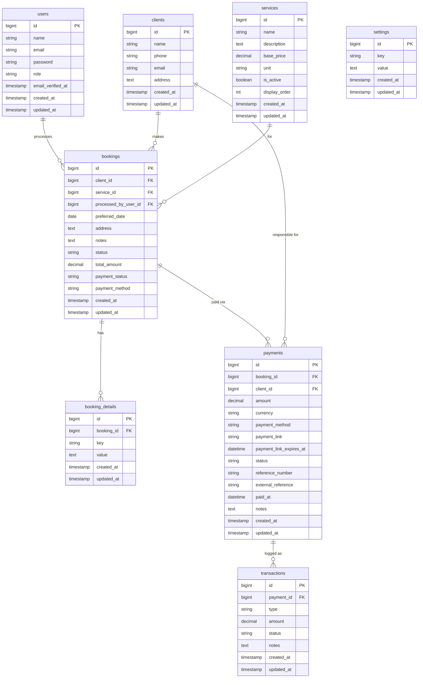

# Database Schema

The CitiMaids database uses **MySQL** and is managed through Laravel Eloquent migrations. There are **8 models** across **10 tables** (including the standard Laravel cache, jobs, and personal access tokens tables).

---

## Entity Relationship Diagram

---

## Tables Reference

### `users`
Admin and staff accounts. The `role` column distinguishes between `admin` and `staff`.

| Column | Type | Notes |
|---|---|---|
| `id` | `bigint` | Primary key |
| `name` | `string` | Display name |
| `email` | `string` | Unique login email |
| `password` | `string` | Hashed |
| `role` | `string` | `admin` or `staff` |

---

### `clients`
Customer records created when a booking is submitted.

| Column | Type | Notes |
|---|---|---|
| `id` | `bigint` | Primary key |
| `name` | `string` | Customer full name |
| `phone` | `string` | Contact phone number |
| `email` | `string` | Contact email (nullable) |
| `address` | `text` | Default service address (nullable) |

---

### `services`
The cleaning service catalogue. Supports admin reordering via `display_order`.

| Column | Type | Notes |
|---|---|---|
| `id` | `bigint` | Primary key |
| `name` | `string` | Service name (e.g. "Deep Cleaning") |
| `description` | `text` | Marketing description |
| `base_price` | `decimal(10,2)` | Starting price in AED |
| `unit` | `string` | Pricing unit (`/ hr`, `flat rate`, etc.) |
| `is_active` | `boolean` | Whether service appears on customer portal |
| `display_order` | `int` | Sort order in catalogue |

---

### `bookings`
Core booking entity linking clients, services, and the processing staff member.

| Column | Type | Notes |
|---|---|---|
| `id` | `bigint` | Primary key |
| `client_id` | `bigint FK` | → `clients.id` |
| `service_id` | `bigint FK` | → `services.id` |
| `processed_by_user_id` | `bigint FK` | → `users.id` (nullable) |
| `preferred_date` | `date` | Customer's requested date |
| `address` | `text` | Service address |
| `notes` | `text` | Additional customer notes |
| `status` | `string` | `pending` · `confirmed` · `in_progress` · `completed` · `cancelled` |
| `total_amount` | `decimal(10,2)` | Final agreed price |
| `payment_status` | `string` | `unpaid` · `paid` · `partial` · `refunded` |
| `payment_method` | `string` | `cash` · `card` · `bank_transfer` · `online` |

---

### `booking_details`
Flexible key-value extra data per booking (e.g. number of rooms, specific tasks).

| Column | Type | Notes |
|---|---|---|
| `id` | `bigint` | Primary key |
| `booking_id` | `bigint FK` | → `bookings.id` |
| `key` | `string` | Detail type (e.g. `rooms`, `floors`) |
| `value` | `text` | Detail value |

---

### `payments`
Payment records attached to a booking. Includes payment link management with expiry.

| Column | Type | Notes |
|---|---|---|
| `id` | `bigint` | Primary key |
| `booking_id` | `bigint FK` | → `bookings.id` |
| `client_id` | `bigint FK` | → `clients.id` |
| `amount` | `decimal(10,2)` | Payment amount in AED |
| `currency` | `string` | Default `AED` |
| `payment_method` | `string` | Payment method used |
| `payment_link` | `string` | External payment gateway URL (nullable) |
| `payment_link_expires_at` | `datetime` | Link expiry timestamp (nullable) |
| `status` | `string` | `pending` · `paid` · `failed` · `refunded` · `partially_refunded` |
| `reference_number` | `string` | Auto-generated: `PAY-YYYYMMDD-XXXX` |
| `external_reference` | `string` | Gateway transaction ID (nullable) |
| `paid_at` | `datetime` | When payment was confirmed (nullable) |
| `notes` | `text` | Admin notes (nullable) |

---

### `transactions`
Immutable log of financial events (charge, refund) linked to a payment.

| Column | Type | Notes |
|---|---|---|
| `id` | `bigint` | Primary key |
| `payment_id` | `bigint FK` | → `payments.id` |
| `type` | `string` | `charge` · `refund` · `partial_refund` |
| `amount` | `decimal(10,2)` | Amount for this transaction |
| `status` | `string` | `success` · `failed` |
| `notes` | `text` | Transaction notes |

---

### `settings`
Key-value store for business configuration. Seeded with the official CitiMaids contact details.

| Column | Type | Notes |
|---|---|---|
| `id` | `bigint` | Primary key |
| `key` | `string` | Setting key (e.g. `phone`, `address`) |
| `value` | `text` | Setting value |

**Default seeded keys:**
- `business_name`, `phone`, `phone_secondary`
- `email`, `email_secondary`
- `address`
- `facebook_url`, `tiktok_url`

---

## Migrations Timeline

| Migration | Description |
|---|---|
| `0001_01_01_000000` | Users table |
| `0001_01_01_000001` | Cache table |
| `0001_01_01_000002` | Jobs table |
| `2026_08_25_125430` | Personal access tokens (Sanctum) |
| `2026_08_25_143110` | Add `role` column to users |
| `2026_08_25_143111` | Clients table |
| `2026_08_25_143112` | Services table |
| `2026_08_25_143113` | Bookings table |
| `2026_08_25_143114` | Booking details table |
| `2026_08_25_143115` | Settings table |
| `2026_09_04_000001` | Add payment columns to bookings |
| `2026_09_04_000002` | Payments table |
| `2026_09_04_000003` | Transactions table |
| `2026_09_04_120000` | Add `display_order` to services |
